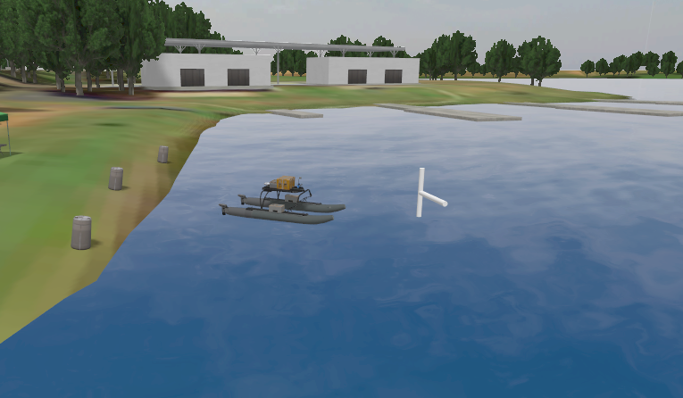
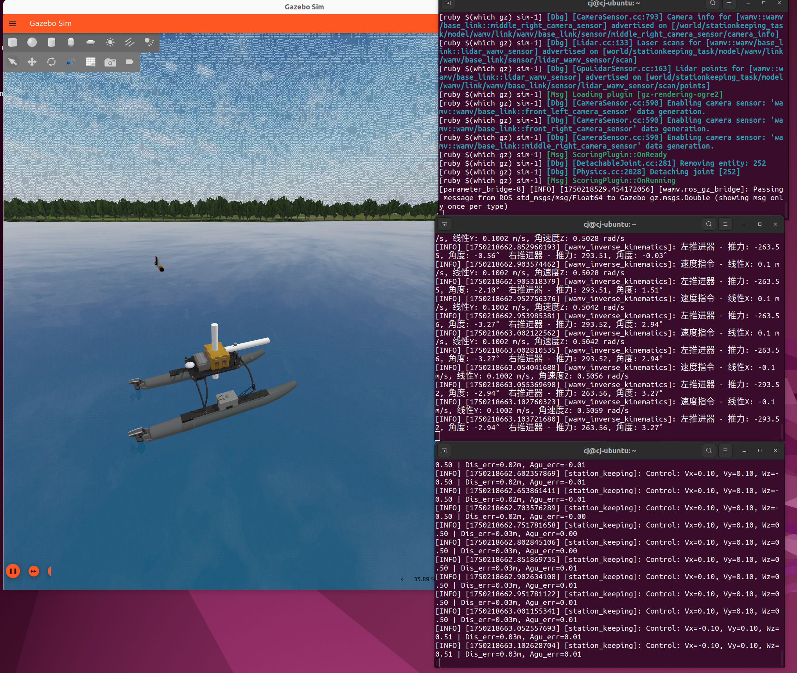

# WAM-V的运动控制与规划
本片介绍了 `my_wamv` 中实现的小船自主运动，并在VRX提供的 [VRX Competition](https://github.com/osrf/vrx/wiki/vrx_2023-task_tutorials) 比赛任务中得到验证。

本文将从逆运动学控制，姿态控制，路径跟踪等方面对 `my_wamv` 包实现的功能进行解析。参考本文的方法可以进一步开发在VRX环境下的小船控制算法。<br><br>


## 逆运动学控制

在VRX官方提供的教程中，WAM-V的操控需要在终端中一一发布左、右桨和舵的对应topic。在实现更进一步的功能之前，我们需要将小船的底层控制整合起来。将期望的运动速度指令转换为两个推进器的推力和角度指令，以便于高层的控制算法专注于路径规划或运动控制策略，而不必关心底层推进器的具体实现细节。

### 一、逆运动学理论推导

对一个双推进器的小船来说，每个推进器对小船施加的力可以沿x、y轴方向分解：

```math
\begin{cases}
F_{1,x} = F_1 \cdot \cos\theta_1 \\
F_{1,y} = F_1 \cdot \sin\theta_1 \\
F_{2,x} = F_2 \cdot \cos\theta_2 \\
F_{2,y} = F_2 \cdot \sin\theta_2
\end{cases}
```

<br>其中， $F_1$ 、 $F_2$ 分别为推进器推力； $\theta_1$ 、 $\theta_2$ 分别为推进器偏角。

参照以下公式建立动力学方程：

```math
\begin{cases}
F_x = \sum_{i=1}^2 F_{i,x} = F_1 \cos\theta_1 + F_2 \cos\theta_2 \\[8pt]
F_y = \sum_{i=1}^2 F_{i,y} = F_1 \sin\theta_1 + F_2 \sin\theta_2 \\[8pt]
M = \sum_{i=1}^2 (x_i F_{i,y} - y_i F_{i,x}) 
\end{cases}
```

<br>其中， $F_x$ 、 $F_y$ 分别为小船在x、y方向受到两推进器的总推力； $M$ 为小船的转矩。

在输入期望的运动速度指令（包含角速度与线速度）后，可以求出所需施加的推力和转矩，满足非线性动力学方程：

```math
\boldsymbol{\nu} = \begin{bmatrix}
V_x \\
V_y \\
\omega_z
\end{bmatrix}, \quad
\boldsymbol{\tau} = \begin{bmatrix}
F_x \\
F_y \\
M
\end{bmatrix} 
```

```math
\boldsymbol{M}\dot{\boldsymbol{\nu}} + \boldsymbol{C}(\boldsymbol{\nu})\boldsymbol{\nu} + \boldsymbol{D}\boldsymbol{\nu} = \boldsymbol{\tau}
```

<br>其中：
- $\boldsymbol{M}$	：系统惯性矩阵（刚体+附加质量）
- $\boldsymbol{C}(\boldsymbol{\nu})$	：科里奥利-向心力矩阵
- $\boldsymbol{D}$	：阻尼矩阵

将 $F_x$ 、 $F_y$ 和 $M$ 看作已知量， $F_{1,x}$ 、 $F_{1,y}$ 、 $F_{2,x}$ 、 $F_{2,y}$ 为未知量，列出矩阵方程：

```math
\begin{bmatrix}
1 & 0 & 1 & 0 \\
0 & 1 & 0 & 1 \\
-y_1 & x_1 & -y_2 & x_2 
\end{bmatrix}
\begin{bmatrix}
F_{1,x} \\
F_{1,y} \\
F_{2,x} \\
F_{2,y} 
\end{bmatrix}
=
\begin{bmatrix}
F_x \\
F_y \\
M
\end{bmatrix}
```

<br>并添加约束：已知两推进器以x轴对称分布；求最小二范数解以保证最小功率消耗。

```math
\quad \text{s.t.} \quad
\begin{cases}
x_1 = x_2 = -x_{\text{offset}} \\
y_1 = -y_2 = y_{\text{offset}} \\
\|F\|_2^2 = F_{1,x}^2 + F_{1,y}^2 + F_{2,x}^2 + F_{2,y}^2 \to \min
\end{cases}
```

<br>最终求得解析解为：
```math
\begin{cases}
F_{1,x}^* = \dfrac{F_x}{2} - \dfrac{x_{\text{offset}}}{2y_{\text{offset}}}F_y - \dfrac{M_z}{2y_{\text{offset}}} \\[10pt]
F_{1,y}^* = \dfrac{F_y}{2} \\[10pt]
F_{2,x}^* = \dfrac{F_x}{2} + \dfrac{x_{\text{offset}}}{2y_{\text{offset}}}F_y + \dfrac{M_z}{2y_{\text{offset}}} \\[10pt]
F_{2,y}^* = \dfrac{F_y}{2}
\end{cases}
```

<br>进而推得每个推进器的推力大小和方向：

```math
\begin{aligned}
F_i = \sqrt{F_{i,x}^2 + F_{i,y}^2} \quad (i=1,2) \\
\theta_i = \arctan\left(\frac{F_{i,y}}{F_{i,x}}\right) \quad (i=1,2)
\end{aligned}
```

<br>至此，我们完成了从输入的运动速度指令 $V_x$ 、 $V_y$ 、 $\omega_z$ 到输出推进器推力和角度 $F_i$ 、 $\theta_i$ 的理论推导过程。


### 二、逆运动学控制算法实现

参照上文提供的逆运动学算法，本篇用python实现了无人船的逆运动学控制代码，参考 [mywamv_inverse_kinematics.py](./my_wamv/mywamv_inverse_kinematics.py)

1. **输入与输出**

输入为ROS `Twist` 消息 `/wamv/cmd_vel`，而输出为两个推进器的推力和角度topic，参考 [VRX教程](./VRX_Tutorial.md)

```python
# 订阅速度指令话题
self.cmd_vel_sub = self.create_subscription(
    Twist,
    '/wamv/cmd_vel',
    self.inverse_kinematics_callback,
    10
)

# 创建推进器指令发布者
self.left_thrust_pub = self.create_publisher(
    Float64,
    '/wamv/thrusters/left/thrust',
    10
)
self.right_thrust_pub = self.create_publisher(
    Float64,
    '/wamv/thrusters/right/thrust',
    10
)
self.left_pos_pub = self.create_publisher(
    Float64,
    '/wamv/thrusters/left/pos',
    10
)
self.right_pos_pub = self.create_publisher(
    Float64,
    '/wamv/thrusters/right/pos',
    10
)
```

2. **Twist消息到小船转矩的转换**

本代码将非线性动力学方程简化为线性关系，系数满足在范围内大致吻合：

```python
# 限制给予的线速度和角速度，保证不会因为过大的输入导致输出异常(前进或转向推力被覆盖)
msg.linear.x = constrain(msg.linear.x, -max_linear, max_linear)
msg.linear.y = constrain(msg.linear.y, -max_linear, max_linear)
msg.angular.z = constrain(msg.angular.z, -max_angular, max_angular)

# 计算期望的总力和力矩
Fx = v_x_gain * msg.linear.x
Fy = v_y_gain * msg.linear.y
Mz = w_z_gain * msg.angular.z
```

如果想要遵从方程准确计算合力与转矩， $\boldsymbol{M}$ 、 $\boldsymbol{C}(\boldsymbol{\nu})$ 和 $\boldsymbol{D}$ 的数据可以在VRX阻力插件 `libSimpleHydrodynamics.so` 中找到。

3. **计算推进器推力与角度**

参照方程计算推力与角度，同时还应注意旋转180度时转换为负推力，将角度限制在 $[-90^\circ, 90^\circ]$ 之间：

```python
# 计算左推进器分力 (F1x, F1y)，设左右点坐标为(-x,y)(-x,-y)
x = abs(left_x)
y = abs(left_y)
F1x = 0.5 * Fx - x / (2 * y) * Fy - Mz / (2 * y) 
F1y = 0.5 * Fy

# 计算右推进器分力 (F2x, F2y)
F2x = 0.5 * Fx + x / (2 * y) * Fy + Mz / (2 * y)
F2y = 0.5 * Fy

# 计算每个推进器的总推力和角度
left_thrust, left_angle = calculate_thrust_and_angle(F1x, F1y)
right_thrust, right_angle = calculate_thrust_and_angle(F2x, F2y)
```

*4. **限制角度变化率**

在现实场景中，小船的舵并不能同仿真环境中一样瞬时到达指定角度，而是以一定的速率缓慢转动到该角度。因此，可以在控制代码中加入对角度变化率的限制，以更真实地模拟实际情况。
根据需求增减这段代码：

```python
# 应用角速度限制（模拟实际桨匀速转向）
current_time = self.get_clock().now()
dt = (current_time - self.last_time).nanoseconds / 1e9
self.last_time = current_time

if dt > 0.0:  # 避免除以零
    # 计算最大允许角度变化
    max_delta_angle = max_angle_rate * dt
    
    # 限制左桨角度变化率
    delta_left = left_angle - self.last_left_angle
    if abs(delta_left) > max_delta_angle:
        left_angle = self.last_left_angle + math.copysign(max_delta_angle, delta_left)
    
    # 限制右桨角度变化率
    delta_right = right_angle - self.last_right_angle
    if abs(delta_right) > max_delta_angle:
        right_angle = self.last_right_angle + math.copysign(max_delta_angle, delta_right)
```

<br>


## 位姿控制

位姿控制是无人船的核心任务之一，在精确导航、抗干扰与稳定跟踪等方面具有重大作用。
VRX官方提供了位姿控制的任务场景，参考 [Station Keeping](https://github.com/osrf/vrx/wiki/vrx_2023-stationkeeping_task) 。小船需完成从初始点到目标点的移动，并在指定点保持固定的位姿。



<br>

本文采用PID控制的方法，通过ROS2节点实现了无人水面艇（USV）的位姿控制，参考 [mywamv_station_keeping.py](./my_wamv/mywamv_station_keeping.py) 。以下是核心逻辑的实现：

1. **传感器与目标输入处理**

- GPS数据：

  利用GPS数据更新当前船体位置 `cur_pos` ，将WGS84坐标（经纬度）转换为局部ENU坐标系（东-北-天），并补偿GPS天线与船体的偏移。

```python
def gps_to_enu(self, lat, lon, alt=0.0):
    """WGS84转ENU坐标系"""
    return pymap3d.geodetic2enu(lat, lon, alt, *self.origin)

def gps_callback(self, msg):
    """处理GPS数据"""
    x, y, _ = self.gps_to_enu(msg.latitude, msg.longitude)
    if self.cur_rot is not None:
        x += self.gps_offset * math.cos(self.cur_rot)
        y += self.gps_offset * math.sin(self.cur_rot)
    self.cur_pos = np.array([x, y])
```

- IMU数据：

  从四元数中提取偏航角（yaw），更新当前船体朝向 `cur_rot`。

```python
def quaternion_to_yaw(self, q):
    """四元数转偏航角yaw"""
    siny_cosp = 2 * (q.w * q.z + q.x * q.y)
    cosy_cosp = 1 - 2 * (q.y * q.y + q.z * q.z)
    return math.atan2(siny_cosp, cosy_cosp)

def imu_callback(self, msg):
    """处理IMU数据"""
    self.cur_rot = self.quaternion_to_yaw(msg.orientation)
```

- 目标位姿：

  订阅VRX任务发布的 `/vrx/stationkeeping/goal` ，解析目标位置 `cmd_pos` 和目标朝向 `cmd_rot` 。

```python
def goal_callback(self, msg):
    """处理目标位置"""
    x, y, _ = self.gps_to_enu(msg.pose.position.x, msg.pose.position.y)
    self.cmd_pos = np.array([x, y])  # 存储ENU坐标系下的目标位置
    self.cmd_rot = self.quaternion_to_yaw(msg.pose.orientation)  # 存储目标偏航角
```

2. **分层控制**

根据与目标的距离 `distance` ，自动切换控制模式，实现快速接近与稳态调节。分层控制包含目标导航（Go-to-Goal）和定点保持（Station-Keeping）两种模式：

```python
if distance > self.goal_tol:
    # Go-to-goal模式（远距离接近）：控制Vx和Wz
    desired_heading = math.atan2(err_vec[1], err_vec[0])
    heading_error = self.normalize_angle(desired_heading - self.cur_rot)
    
    cmd_vel.linear.x = np.clip(self.v_const * distance, -self.v_limit, self.v_limit)
    cmd_vel.angular.z = self.pid_g2g.control(heading_error, t_now)
else:
    # Station-keeping模式
    body_x = math.cos(self.cur_rot)
    body_y = math.sin(self.cur_rot)
    along_track = err_vec[0] * body_x + err_vec[1] * body_y
    cross_track = -err_vec[0] * body_y + err_vec[1] * body_x

    # 动态响应调整
    adaptive_gain = min(1.0, distance / self.goal_tol)
    along_track *= adaptive_gain
    cross_track *= adaptive_gain

    cmd_vel.linear.x = self.pid_sk_vx.control(along_track, t_now)
    cmd_vel.linear.y = self.pid_sk_vy.control(cross_track, t_now)
    cmd_vel.angular.z = self.pid_sk_wz.control(
        self.normalize_angle(self.cmd_rot - self.cur_rot), t_now
    )
```

3. **PID控制器设计**

根据不同的要求调整PID参数。在导航模式中增大比例以强调快速响应，在定点保持阶段增大微分以抑制振荡。

```python
class PIDController:
    def __init__(self, kP=1.0, kI=0.0, kD=0.0):
        self.kP = kP         # 比例增益
        self.kI = kI         # 积分增益
        self.kD = kD         # 微分增益
        self.err_int = 0.0   # 积分误差累积
        self.err_prev = 0.0  # 上一次的误差值
        self.t_prev = 0.0    # 上一次调用的时间戳

    def control(self, err, t):
        dt = t - self.t_prev
        if dt <= 0:
            return 0.0
        
        # 积分抗饱和（仅在小误差时启用）
        if abs(err) < 2.0:
            self.err_int += err * dt
            self.err_int = np.clip(self.err_int, -10.0, 10.0)
        
        # 微分项
        err_dif = (err - self.err_prev) / dt if dt > 0 else 0.0
        
        # PID输出
        u = self.kP * err + self.kI * self.err_int + self.kD * err_dif
        u = np.clip(u, -5.0, 5.0)  # 通用输出限制
        
        self.err_prev = err
        self.t_prev = t
        return u
```

4. **调试与验证**

在完成脚本的搭建后，将脚本放在主目录下，运行仿真环境并验证控制效果。
如果自定义了WAM-V配置，可以将路径修改为自定义URDF文件地址。

```bash
ros2 launch vrx_gz competition.launch.py world:=stationkeeping_task
or
ros2 launch vrx_gz competition.launch.py world:=stationkeeping_task urdf:=<your_pathto_wamv>
```

运行逆运动学脚本，同样放在主目录下：

```bash
chmod +x mywamv_inverse_kinematics.py
./mywamv_inverse_kinematics.py
```

添加脚本路径，并运行脚本。

```bash
chmod +x mywamv_station_keeping.py
./mywamv_station_keeping.py
```

查看小船是否保持位姿，以及根据稳态误差调节PID参数：



<br>

## way_finding


## path_following
### 路径发布
### 可视化
### 理论
### 实现


## 项目整合
