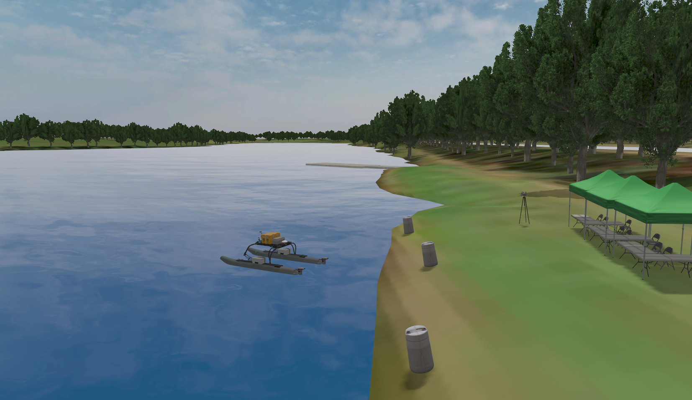

# USV_simulator-in-VRX

# VRX教程  

VRX(Virtual RobotX)是一个无人船的仿真环境，与RobotX比赛合作提供了水面无人船的仿真环境和任务，以及WAM-V平台。该项目模拟了真实的海洋场景，包括基于Fossen的波浪、洋流和风场模型；也搭建了全面的无人船平台，并提供了Lidar、摄像头、GPS和IMU等组件。

*下文将从安装、基础操作和深度解析三个方面对vrx进行解析。*
官方教程可参考[VRX Tutorial](https://github.com/osrf/vrx/wiki/tutorials)。

## 安装

官方教程[VRX Getting Started](https://github.com/osrf/vrx/wiki/getting_started_tutorial)。

本文的操作环境如下。新安装建议采用最新Release推荐版本*Gazebo Harmonic* 和 *ROS 2 Jazzy*。
```
ubuntu 22.04.5
ROS2 Humble
gazebo garden v7.9.0
vrx v2.4.1
```

### 一、安装基础环境

1.按照官方文档安装*ROS 2 Jazzy* 和 *Gazebo Harmonic*:

- [<u>ROS 2 Jazzy</u>](https://docs.ros.org/en/jazzy/Installation/Ubuntu-Install-Debs.html)
- [<u>Gazebo Harmonic</u>](https://gazebosim.org/docs/harmonic/install_ubuntu/)

2.安装依赖：

```bash
sudo apt install python3-sdformat14 ros-jazzy-xacro
```

### 二、安装VRX

1.创建colcon工作空间并克隆VRX仓库

```bash
mkdir -p ~/vrx_ws/src
cd ~/vrx_ws/src
git clone https://github.com/osrf/vrx.git
```

2.加载ROS2环境

```bash
source /opt/ros/jazzy/setup.bash
```

3.构建工作空间

```bash
cd ~/vrx_ws
colcon build --merge-install
```

4.配置运行环境

构建完成后，每次运行仿真前，都要加载 `setup.bash` 脚本。在根目录执行：

```bash
. install/setup.bash
```

（可选）为避免每次启动都要加载，可以在 `~/.bashrc` 文件(隐藏文件)中添加：

```bash
source ~/vrx_ws/install/setup.bash
```

5.尝试运行

第一次运行时，会同步从 [vrx collection on Fuel](https://app.gazebosim.org/OpenRobotics/fuel/collections/vrx) 下载3D模型，可能需要等待一段时间。

```bash
ros2 launch vrx_gz competition.launch.py world:=sydney_regatta
```



## VRX环境基础操作指引

参考官方文档 [<u>Getting Around the VRX Environment</u>](https://github.com/osrf/vrx/wiki/getting_around_tutorial)

### 一、WAM-V基础操纵

在终端输入以下命令，可以打开仿真环境，并加载一个带有两个舵两个桨的无人船：

```bash
ros2 launch vrx_gz competition.launch.py world:=sydney_regatta
```


在ROS topic中可以查看到以下topic，分别控制两舵的方向和螺旋桨的转速。注意，舵的控制范围在±π (±3.14)之间。

```bash
/wamv/thrusters/left/pos
/wamv/thrusters/left/thrust
/wamv/thrusters/right/pos
/wamv/thrusters/right/thrust
```

1.终端操作

为了操纵无人船移动，需要在ROS发布对应的话题，给予两桨一定的转速，或给予两舵一定的方向

可以直接在终端输入类似的代码：

```bash
ros2 topic pub --once /wamv/thrusters/left/thrust std_msgs/msg/Float64 "{data: 20.0}"  # 左桨向前
ros2 topic pub --once /wamv/thrusters/right/thrust std_msgs/msg/Float64 "{data: -20.0}"  # 右桨向后
ros2 topic pub --once /wamv/thrusters/left/pos std_msgs/msg/Float64 "{data: -3.14}"  # 左舵旋转
ros2 topic pub --once /wamv/thrusters/right/pos std_msgs/msg/Float64 "{data: 3.14}"  # 右舵旋转
```

也可以利用rqt可视化调节，打开终端输入：

```bash
rqt
```

这将打开与下图类似的窗口。点击 `Plugins` 下拉菜单，找到 `Topics` 选项，然后点击 `Message Publisher` 。
从topic列表中依次选择四个推进器角度/桨主题，点击右侧加号添加。点击每个主题旁的箭头展开详情，在 `expression` 字段查看和修改当前数值。
若要发布指令，双击对应主题的 `expression` ，修改数值后点击左边对勾发布。


2.手柄控制

vrx也提供了手柄操控小船的脚本，保存在 `/vrx/vrx_gz/launch` 下，安装手柄相关依赖后可以launch启动对应文件：

```bash
sudo apt install ros-jazzy-joy-teleop  # 初次启动需要安装相关依赖
ros2 launch vrx_gz usv_joy_teleop.py
```

启动后， `L1` 键作为安全开关需要在操控时保持全程按下的状态。左、右摇杆分别控制左、右推进器的推力和旋转，如下所示：

- 左摇杆上下轴（轴1）→ 左推进器前进/后退
- 右摇杆上下轴（轴3）→ 右推进器前进/后退
- 左摇杆左右轴（轴2）→ 左推进器顺时针/逆时针旋转
- 右摇杆左右轴（轴4）→ 右推进器顺时针/逆时针旋转

常见问题排除：

如果手柄操纵出现问题首先可以先观察手柄是否正确连接：

```bash
ls /dev/input/
```

观察输出是否出现类似 `js0` 的字样。

其次，可以考虑手柄的轴配置是否正确，在配置文件 [wamv.yaml](./vrx_ws/install/share/vrx_gz/config/wamv.yaml) 中修改映衬轴（如将右摇杆对应轴改为3,4），以排除手柄轴发出与接收信号不匹配的问题。

最后，可以利用GTK工具对手柄进行校准，终端输入命令打开后，点击 `properties` ，进入 `calibration` 进行校准，并检测各轴的输出。

```bash
jstest-gtk
```

3*.整体控制小船的运动，可以参考 `/my_wamv/mywamv_inverse_kinematic.py` 脚本中的做法。
[跳转到对应标题](#逆运动学控制)

### 世界

VRX提供了一组基础世界环境，包含水体、天空、海岸线以及固定位置的 RobotX 元素。参考基础的世界文件，我们可以轻松创建自定义的世界，甚至向运行中的仿真系统动态添加新元素。

1.修改世界配置文件

注意到前文提供的启动命令：

```bash
ros2 launch vrx_gz competition.launch.py world:=sydney_regatta
```

这实际上启动了一个名为 [sydney_regatta.sdf](./vrx_ws/install/share/vrx_gz/worlds/sydney_regatta.sdf) 的世界配置文件。
关于 `.sdf` 文件的格式，可以参考 [SDFormat](http://sdformat.org/tutorials?tut=spec_world&cat=specification&)。

我们可以直接在其中增减或修改各环境因素的组件，以对测试环境进行快速的修改，包括：

- 障碍物

可以自由增减避障用的浮标，在不考虑障碍物的测试环境中建议删除。

```bash
<include>
      <name>mb_marker_buoy_red</name>
      <pose>-528 191 0 0 0 0</pose>
      <uri>https://fuel.gazebosim.org/1.0/openrobotics/models/mb_marker_buoy_red</uri>

      ......

      </plugin>
    </include>
```


- 风力组件

调整 `wind_direction` 和 `wind_mean_velocity` 以修改风向和风速。以及风阻系数（coeff_vector）和其他随机参数。

```bash
<!-- Load the plugin for the wind --> 
<plugin
  filename="libUSVWind.so"
  name="vrx::USVWind">
  <wind_obj>
    <name>wamv</name>
    <link_name>wamv/base_link</link_name>
    <coeff_vector>.5 .5 .33</coeff_vector>
  </wind_obj>
  <!-- Wind -->
  <wind_direction>240</wind_direction>
  <!-- in degrees -->
  <wind_mean_velocity>0.0</wind_mean_velocity>
  <var_wind_gain_constants>0</var_wind_gain_constants>
  <var_wind_time_constants>2</var_wind_time_constants>
  <random_seed>10</random_seed>
  <!-- set to zero/empty to randomize -->
  <update_rate>10</update_rate>
  <topic_wind_speed>/vrx/debug/wind/speed</topic_wind_speed>
  <topic_wind_direction>/vrx/debug/wind/direction</topic_wind_direction>
 </plugin>
```

- 波浪场组件

包含4个波浪参数， 波浪方向 (direction)、波浪增益 (gain)、波浪周期 (period)和波浪陡度 (steepness)。

```bash
<!-- The wave field -->
    <plugin filename="libPublisherPlugin.so" name="vrx::PublisherPlugin">
      <message type="gz.msgs.Param" topic="/vrx/wavefield/parameters"
               every="2.0">
        params {
          key: "direction"
          value {
            type: DOUBLE
            double_value: 0.0
          }
        }
        params {
          key: "gain"
          value {
            type: DOUBLE
            double_value: 0.3
          }
        }
        params {
          key: "period"
          value {
            type: DOUBLE
            double_value: 5
          }
        }
        params {
          key: "steepness"
          value {
            type: DOUBLE
            double_value: 0
          }
        }
      </message>
    </plugin>
```


关于VRX如何对这些环境因素进行仿真，以及组件的具体细节，可以查看 [跳转](#VRX各组件的具体定义)


## WAM-V无人船的操纵和修改


## VRX各组件的具体定义


## 逆运动学控制

# station_keeping
# way_finding
# path_following
