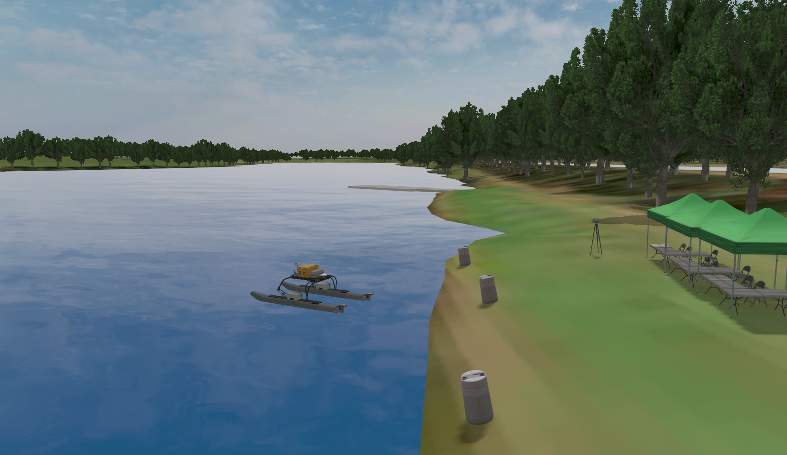
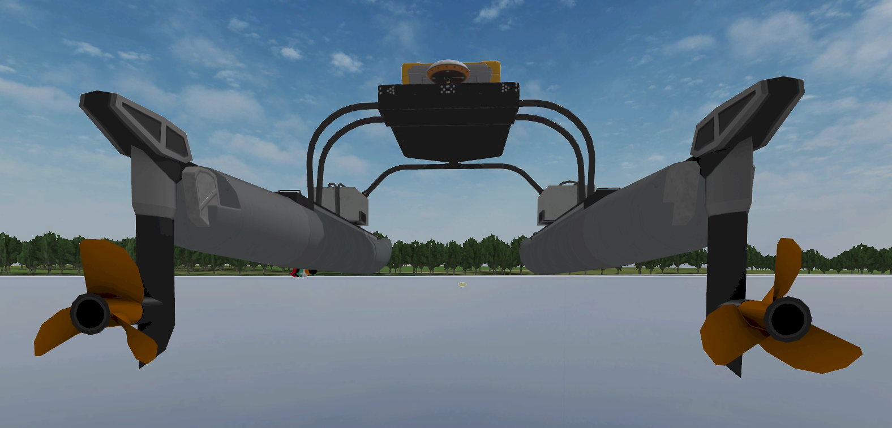
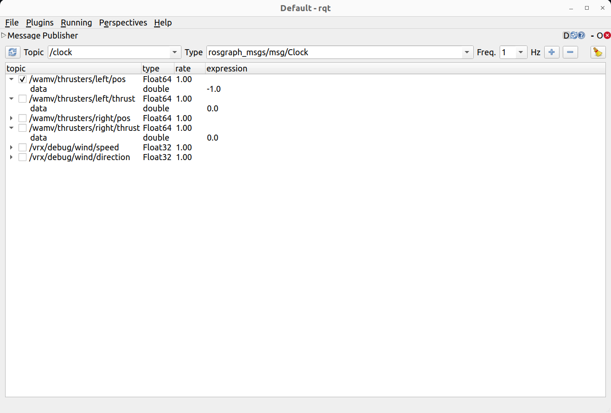
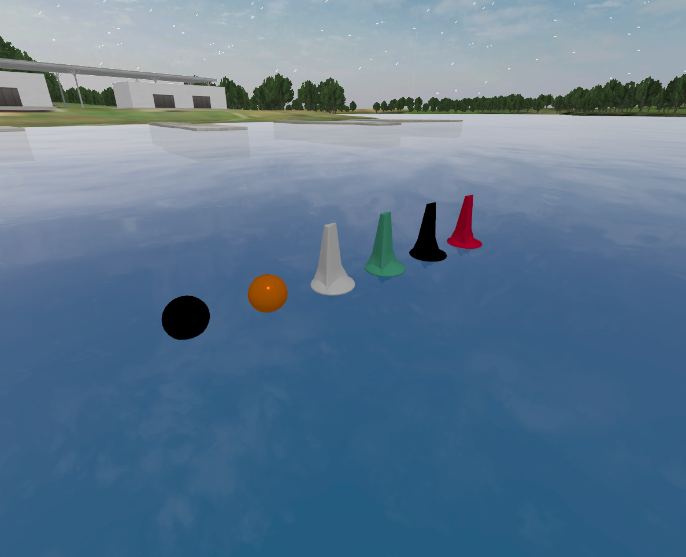
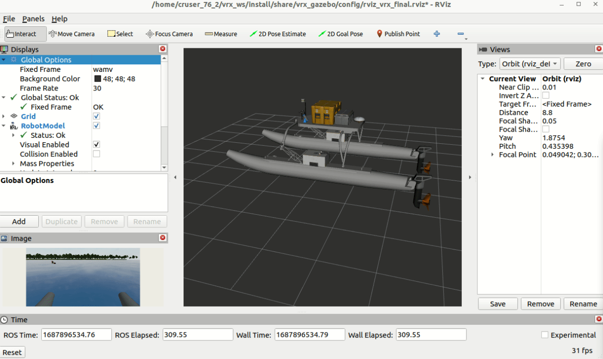
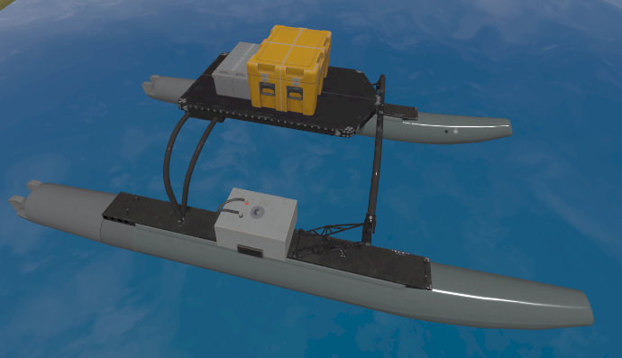
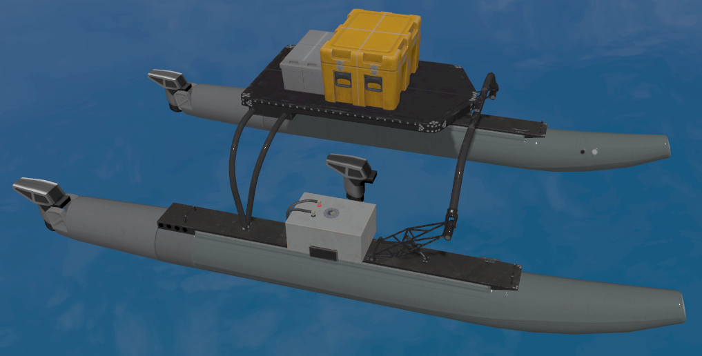
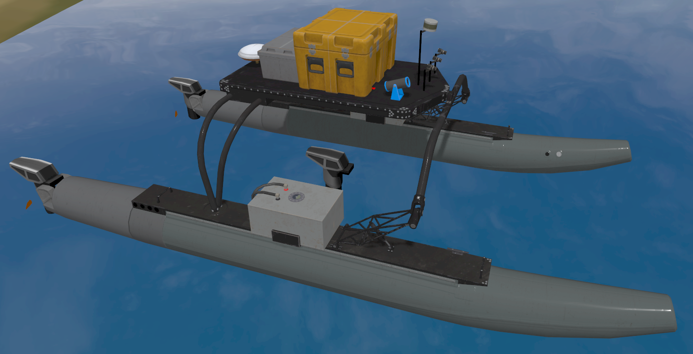

# VRX教程  

VRX(Virtual RobotX)是一个无人船的仿真环境，与RobotX比赛合作提供了水面无人船的仿真环境和任务，以及WAM-V平台。该项目模拟了真实的海洋场景，包括基于Fossen的波浪、洋流和风场模型；也搭建了全面的无人船平台，并提供了Lidar、摄像头、GPS和IMU等组件。下文将从安装和自定义WAMV等方面对VRX进行解析。<br><br>

官方教程可参考 [VRX Tutorial](https://github.com/osrf/vrx/wiki/tutorials)。


---


## 安装

官方教程 [VRX Getting Started](https://github.com/osrf/vrx/wiki/getting_started_tutorial)。

本文的操作环境如下。新安装建议采用最新Release推荐版本*Gazebo Harmonic* 和 *ROS 2 Jazzy*。
```
ubuntu 22.04.5
ROS2 Humble
gazebo garden v7.9.0
vrx v2.4.1
```

### 一、安装基础环境

1.按照官方文档安装 *ROS 2 Jazzy* 和 *Gazebo Harmonic*:

- [<u>ROS 2 Jazzy</u>](https://docs.ros.org/en/jazzy/Installation/Ubuntu-Install-Debs.html)
- [<u>Gazebo Harmonic</u>](https://gazebosim.org/docs/harmonic/install_ubuntu/)

2.安装依赖：

```bash
sudo apt install python3-sdformat14 ros-jazzy-xacro
```

### 二、安装VRX

1.创建colcon工作空间并克隆VRX仓库

```bash
mkdir -p ~/vrx_ws/src
cd ~/vrx_ws/src
git clone https://github.com/osrf/vrx.git
```

2.加载ROS2环境

```bash
source /opt/ros/jazzy/setup.bash
```

3.构建工作空间

```bash
cd ~/vrx_ws
colcon build --merge-install
```

4.配置运行环境

构建完成后，每次运行仿真前，都要加载 `setup.bash` 脚本。在根目录执行：

```bash
. install/setup.bash
```

（可选）为避免每次启动都要加载，可以在 `~/.bashrc` 文件(隐藏文件)中添加：

```bash
source ~/vrx_ws/install/setup.bash
```

5.尝试运行

第一次运行时，会同步从 [vrx collection on Fuel](https://app.gazebosim.org/OpenRobotics/fuel/collections/vrx) 下载3D模型，可能需要等待一段时间。

```bash
ros2 launch vrx_gz competition.launch.py world:=sydney_regatta
```




---


## VRX环境基础操作指引

参考官方文档 [<u>Getting Around the VRX Environment</u>](https://github.com/osrf/vrx/wiki/getting_around_tutorial)

### 一、WAM-V基础操纵

在终端输入以下命令，可以打开仿真环境，并加载一个带有两个舵两个桨的无人船：

```bash
ros2 launch vrx_gz competition.launch.py world:=sydney_regatta
```



在ROS topic中可以查看到以下topic，分别控制两舵的方向和螺旋桨的转速。注意，舵的控制范围在±π (±3.14)之间。

```bash
/wamv/thrusters/left/pos
/wamv/thrusters/left/thrust
/wamv/thrusters/right/pos
/wamv/thrusters/right/thrust
```

1. **终端操作**

为了操纵无人船移动，需要在ROS发布对应的话题，给予两桨一定的转速，或给予两舵一定的方向

可以直接在终端输入类似的代码：

```bash
ros2 topic pub --once /wamv/thrusters/left/thrust std_msgs/msg/Float64 "{data: 20.0}"  # 左桨向前
ros2 topic pub --once /wamv/thrusters/right/thrust std_msgs/msg/Float64 "{data: -20.0}"  # 右桨向后
ros2 topic pub --once /wamv/thrusters/left/pos std_msgs/msg/Float64 "{data: -3.14}"  # 左舵旋转
ros2 topic pub --once /wamv/thrusters/right/pos std_msgs/msg/Float64 "{data: 3.14}"  # 右舵旋转
```

也可以利用rqt可视化调节，打开终端输入：

```bash
rqt
```

这将打开与下图类似的窗口。点击 `Plugins` 下拉菜单，找到 `Topics` 选项，然后点击 `Message Publisher` 。
从topic列表中依次选择四个推进器角度/桨主题，点击右侧加号添加。点击每个主题旁的箭头展开详情，在 `expression` 字段查看和修改当前数值。
若要发布指令，双击对应主题的 `expression` ，修改数值后点击左边对勾发布。



2. **手柄控制**

vrx也提供了手柄操控小船的脚本，保存在 `/vrx/vrx_gz/launch` 下，安装手柄相关依赖后可以launch启动对应文件：

```bash
sudo apt install ros-jazzy-joy-teleop  # 初次启动需要安装相关依赖
ros2 launch vrx_gz usv_joy_teleop.py
```

启动后， `L1` 键作为安全开关需要在操控时保持全程按下的状态。左、右摇杆分别控制左、右推进器的推力和旋转，如下所示：

- 左摇杆上下轴（轴1）→ 左推进器前进/后退
- 右摇杆上下轴（轴3）→ 右推进器前进/后退
- 左摇杆左右轴（轴2）→ 左推进器顺时针/逆时针旋转
- 右摇杆左右轴（轴4）→ 右推进器顺时针/逆时针旋转

常见问题排除：

如果手柄操纵出现问题首先可以先观察手柄是否正确连接：

```bash
ls /dev/input/
```

观察输出是否出现类似 `js0` 的字样。

其次，可以考虑手柄的轴配置是否正确，在配置文件 [wamv.yaml](./vrx_ws/install/share/vrx_gz/config/wamv.yaml) 中修改映衬轴（如将右摇杆对应轴改为3,4），以排除手柄轴发出与接收信号不匹配的问题。

最后，可以利用GTK工具对手柄进行校准，终端输入命令打开后，点击 `properties` ，进入 `calibration` 进行校准，并检测各轴的输出。

```bash
jstest-gtk
```

3*.整体控制小船的运动，可以参考另一篇文章 `/my_wamv/mywamv_inverse_kinematic.py` 脚本中的做法。

### 二、创建和修改仿真环境

VRX提供了一组基础世界环境，包含水体、天空、海岸线以及固定位置的 RobotX 元素。参考基础的世界文件，我们可以轻松创建自定义的世界，甚至向运行中的仿真系统动态添加新元素。

1. **修改世界配置文件**

注意到前文提供的启动命令：

```bash
ros2 launch vrx_gz competition.launch.py world:=sydney_regatta
```

这实际上启动了一个名为 [sydney_regatta.sdf](./vrx_ws/install/share/vrx_gz/worlds/sydney_regatta.sdf) 的世界配置文件。
关于 `.sdf` 文件的格式，可以参考 [SDFormat](http://sdformat.org/tutorials?tut=spec_world&cat=specification&)。

我们可以直接在其中增减或修改各环境因素的组件，以对测试环境进行快速的修改，包括：

- 障碍物

可以自由增减避障用的浮标，在不考虑障碍物的测试环境中建议删除。

```xml
<include>
      <name>mb_marker_buoy_red</name>
      <pose>-528 191 0 0 0 0</pose>
      <uri>https://fuel.gazebosim.org/1.0/openrobotics/models/mb_marker_buoy_red</uri>

      ......

      </plugin>
    </include>
```



- 风力组件

调整 `wind_direction` 和 `wind_mean_velocity` 以修改风向和风速。以及风阻系数`coeff_vector`和其他随机参数。

```xml
<!-- Load the plugin for the wind --> 
<plugin
  filename="libUSVWind.so"
  name="vrx::USVWind">
  <wind_obj>
    <name>wamv</name>
    <link_name>wamv/base_link</link_name>
    <coeff_vector>.5 .5 .33</coeff_vector>
  </wind_obj>
  <!-- Wind -->
  <wind_direction>240</wind_direction>
  <!-- in degrees -->
  <wind_mean_velocity>0.0</wind_mean_velocity>
  <var_wind_gain_constants>0</var_wind_gain_constants>
  <var_wind_time_constants>2</var_wind_time_constants>
  <random_seed>10</random_seed>
  <!-- set to zero/empty to randomize -->
  <update_rate>10</update_rate>
  <topic_wind_speed>/vrx/debug/wind/speed</topic_wind_speed>
  <topic_wind_direction>/vrx/debug/wind/direction</topic_wind_direction>
 </plugin>
```

- 波浪场组件

包含4个波浪参数， 波浪方向 (direction)、波浪增益 (gain)、波浪周期 (period)和波浪陡度 (steepness)。

```xml
<!-- The wave field -->
    <plugin filename="libPublisherPlugin.so" name="vrx::PublisherPlugin">
      <message type="gz.msgs.Param" topic="/vrx/wavefield/parameters"
               every="2.0">
        params {
          key: "direction"
          value {
            type: DOUBLE
            double_value: 0.0
          }
        }
        params {
          key: "gain"
          value {
            type: DOUBLE
            double_value: 0.3
          }
        }
        params {
          key: "period"
          value {
            type: DOUBLE
            double_value: 5
          }
        }
        params {
          key: "steepness"
          value {
            type: DOUBLE
            double_value: 0
          }
        }
      </message>
    </plugin>
```


2. **启动自定义的世界文件**

除了在原世界文件中直接修改外，也可以自己创建新的世界文件。以 `sydney_regatta.sdf` 为基础，通过以下方式创造一个仅包含水体、天空和海岸的基本环境。复制地址改为vrx实际安装地址。

```bash
$ mkdir example_vrx_package
$ cd example_vrx_package/
$ cp <YOUR_VRX_INSTALLATION>/src/vrx/vrx_gz/worlds/sydney_regatta.sdf sydney_regatta_custom.sdf
```

打开创建的 `sydney_regatta_custom.sdf` 文件，并添加想要的组件。比如，在 </world> 标签前插入以下代码，添加一个避障的浮标:

```xml
<model name="navigation_buoy">
  <pose>10 5 0 0 0 0</pose>
  <include>
    <uri>https://fuel.gazebosim.org/1.0/osrf/models/navigation_buoy</uri>
  </include>
</model>
```

接着，更新Gazebo资源路径，将刚刚创建的世界文件路径输入 `GZ_SIM_RESOURCE_PATH` ：

```bash
export GZ_SIM_RESOURCE_PATH=/home/caguero/example_vrx_package:$GZ_SIM_RESOURCE_PATH
```

最后，启动自定义的世界文件：

```bash
ros2 launch vrx_gz competition.launch.py world:=sydney_regatta_custom
```


关于VRX如何对这些环境因素进行仿真，以及组件的具体细节，可以查看 [WAMV参数配置](#五WAMV参数配置)

### 三、RViz仿真可视化
官方提供了为WAM-V配置的RViz文件和启动脚本，参考 [rviz.launch.py](./vrx_ws/install/share/vrx_gazebo/launch/rviz.launch.py) 。先启动gazebo并运行仿真环境：


```bash
ros2 launch vrx_gz competition.launch.py world:=sydney_regatta
```

然后运行RViz：

```bash
ros2 launch vrx_gazebo rviz.launch.py
```



如果想要启动自己配置的RViz文件，可以将配置文件放在 `<YOUR_VRX_INSTALLATION>/install/share/vrx_gazebo/config/` 下，并修改启动脚本 `rviz.launch.py` ，改为自己配置的文件名：

```python
rvz = Node(
      package='rviz2',
      namespace='',
      executable='rviz2',
      name='rviz2',
      arguments=['-d' + os.path.join(get_package_share_directory('vrx_gazebo'), 'config', 'rviz_vrx_rsp.rviz')]
        )
```

修改示例可参考另一篇文章中针对固定视角的调整。


### 四、自定义WAM-V推进器与组件

VRX提供了简易的自定义WAM-V配置和URDF文件生成方法。通过编写推进器YAML配置文件和组件YAML配置文件，可以运行脚本自动生成包含指定推进器和组件的自定义WAM-V URDF文件。参考 [Customizing the WAM-V (Beginner)](https://github.com/osrf/vrx/wiki/customizing_wamv_beginner_tutorial)

1. **创建空的WAM-V模型**

首先，我们需要创建一个基础的WAM-V模型以便后续添加组件和推进器。创建目录并创建两个空白配置文件：

```bash
mkdir ~/my_wamv
cd ~/my_wamv
touch empty_thruster_config.yaml  # 推进器配置文件
touch empty_component_config.yaml  # 组件配置文件
```

使用VRX自带的生成脚本 `generate_wamv.launch.py` ，读取推进器和组件配置文件，并生成新的URDF模型。

```bash
ros2 launch vrx_gazebo generate_wamv.launch.py \
    component_yaml:=`pwd`/empty_component_config.yaml \
    thruster_yaml:=`pwd`/empty_thruster_config.yaml \
    wamv_target:=`pwd`/wamv_target.urdf \
    wamv_locked:=False
```

打开生成的URDF文件，验证生成的WAM-V模型。应该看到一个没有推进器和任何组件的模型。

```bash
ros2 launch vrx_gz competition.launch.py world:=sydney_regatta urdf:=`pwd`/wamv_target.urdf
```



2. **自定义推进器配置**

在之前创建的推进器配置文件中，参照以下内容修改文件：

```yaml
engine:
  - prefix: "left"  # 左侧推进器
    position: "-2.373776 1.027135 0.318237"  # XYZ坐标(m)
    orientation: "0.0 0.0 0.0"  # 欧拉角(弧度)
  - prefix: "right"  # 右侧推进器
    position: "-2.373776 -1.027135 0.318237"
    orientation: "0.0 0.0 0.0"
  - prefix: "middle"  # 中部推进器
    position: "0 0 0.318237"
    orientation: "0.0 0.0 0.0"
```

生成新的带推进器的WAM-V模型，注意先删除老的URDF文件。

```bash
ros2 launch vrx_gazebo generate_wamv.launch.py \
    component_yaml:=`pwd`/empty_component_config.yaml \
    thruster_yaml:=`pwd`/example_thruster_config.yaml \
    wamv_target:=`pwd`/wamv_target.urdf \
    wamv_locked:=False
```

这会生成三个"T"字型分布的推进器，如图所示：




3. **自定义组件配置**

相同地，修改 `example_component_config.yaml` :

```yaml
wamv_camera:
    - name: front_left_camera
      visualize: False
      x: 0.75
      y: 0.1
      z: 1.5
      R: 0.0
      P: ${radians(15)}
      Y: 0.0
      post_Y: 0.0
    - name: front_right_camera
      visualize: False
      x: 0.75
      y: -0.1
      z: 1.5
      R: 0.0
      P: ${radians(15)}
      Y: 0.0
      post_Y: 0.0
    - name: far_left_camera
      visualize: False
      x: 0.75
      y: 0.3
      z: 1.5
      R: 0.0
      P: ${radians(15)}
      Y: 0.0
      post_Y: 0.0
wamv_gps:
    - name: gps_wamv
      x: -0.85
      y: 0.0
      z: 1.3
      R: 0.0
      P: 0.0
      Y: 0.0
wamv_imu:
    - name: imu_wamv
      x: 0.3
      y: -0.2
      z: 1.3
      R: 0.0
      P: 0.0
      Y: 0.0
lidar:
    - name: lidar_wamv
      type: 16_beam
      x: 0.7
      y: 0.0
      z: 1.8
      R: 0.0
      P: ${radians(8)}
      Y: 0.0
      post_Y: 0.0
wamv_ball_shooter:
    - name: ball_shooter
      x: 0.55 
      y: -0.3 
      z: 1.3
      pitch: ${radians(-20)}
      yaw: 0.0
wamv_pinger:
    - sensor_name: receiver
      position: 1.0 0 -1.0
```

然后，生成URDF文件：

```bash
ros2 launch vrx_gazebo generate_wamv.launch.py component_yaml:=`pwd`/example_component_config.yaml thruster_yaml:=`pwd`/example_thruster_config.yaml wamv_target:=`pwd`/wamv_target.urdf wamv_locked:=False
```

这将生成一个与默认WAM-V拥有相同组件的模型，仅调整了组件的位置。




### *五、WAMV参数配置

WAM-V无人艇的行为由一组Gazebo插件控制，其中水动力特性和推进系统的相关参数通过两个xacro文件设置：

- 水动力参数（如阻力和附加质量）在 [wamv_gazebo_dynamics_plugin.xacro](./vrx_ws/install/share/wamv_gazebo/urdf/dynamics/wamv_gazebo_dynamics_plugin.xacro) 中配置

- 推进器特性（如推力限制/线性非线性映射）在 [wamv_gazebo_thruster_config.xacro](./vrx_ws/install/share/wamv_gazebo/urdf/thruster_layouts/wamv_gazebo_thruster_config.xacro) 中配置

关于数值推导的详细理论方法，可以参考这篇论文 [Station-keeping control of an unmanned surface vehicle exposed to current and wind disturbances](https://doi.org/10.1016/j.oceaneng.2016.09.037)

在仿真过程中，可能会遇到小船最大速度过慢的问题，可以参考 [How to change the boat velocity](https://github.com/osrf/vrx/issues/731) 对上述xacro文件进行修改。


1. **水动力参数**

- **流体动力学模型**：基于 `libSurface.so` 插件实现左、右船体多浮力作用点的波浪适应性浮力计算。

```xml
<plugin filename="libSurface.so" name="vrx::Surface">
  <link_name>${namespace}/base_link</link_name>
  <hull_length>4.9</hull_length>       <!-- 圆柱体船体长度（米） -->
  <hull_radius>0.213</hull_radius>     <!-- 圆柱体船体半径（米） -->
  <fluid_level>0</fluid_level>         <!-- 流体表面高度（世界坐标系Z=0） -->
  <points>                             <!-- 浮力作用点（局部坐标系） -->
    <point>0.6 1.03 0</point>          <!-- 前作用点 -->
    <point>-1.4 1.03 0</point>         <!-- 后作用点-->
  </points>
  <wavefield>
    <topic>/vrx/wavefield/parameters</topic>  <!-- 波浪参数话题 -->
  </wavefield>
</plugin>
```

- **阻力模型**：基于 `libSimpleHydrodynamics.so` 插件，参照Fossen的经典海洋载具动力学模型模拟，包括：
  - 附加质量效应（Added Mass)
    船加速运动带动流体一起运动产生“虚拟质量”，与加速度相关。加速更难，减速更易。
  - 线性与非线性阻力（Drag Forces） 
    - 线性阻尼：与速度正比，主导低速  
    - 二次阻尼：与速度平方正比，主导高速  
  - 科里奥利力（Coriolis Force）  
    旋转产生惯性力，以及附加质量与物体运动的耦合。v,w同时存在时，转向更困难。

```xml
<plugin filename="libSimpleHydrodynamics.so" name="vrx::SimpleHydrodynamics">
  <link_name>${namespace}/base_link</link_name>
  <!-- 附加质量（单位：kg） -->
  <xDotU>0.0</xDotU>   <!-- Surge方向附加质量 -->
  <yDotV>0.0</yDotV>   <!-- Sway方向附加质量 -->
  <nDotR>0.0</nDotR>   <!-- Yaw旋转附加质量 -->

  <!-- 线性阻力系数（单位：N/(m/s)） -->
  <xU>100.0</xU>       <!-- Surge方向线性阻力 -->
  <yV>100.0</yV>       <!-- Sway方向线性阻力 -->
  <zW>500.0</zW>       <!-- Heave方向线性阻力 -->

  <!-- 二次阻力系数（单位：N/(m/s)^2） -->
  <xUU>150.0</xUU>     <!-- Surge方向二次阻力 -->
  <yVV>100.0</yVV>     <!-- Sway方向二次阻力 -->
  <nRR>800.0</nRR>     <!-- Yaw旋转二次阻力 -->
</plugin>
```

2. **推进器特性**

```xml
<gazebo>
    <!-- 阻力系数参数 -->
    <xacro:property name="x_uu" value="72.4" />  <!-- 二次阻力系数(kg/m) -->
    <xacro:property name="x_u" value="51.3" />    <!-- 线性阻力系数(kg/s) -->
    <xacro:property name="max_velocity_mps" value="10.71667" />  <!-- 最大航速(m/s) -->

    <!-- 推进器插件配置 -->
    <plugin
      filename="gz-sim-thruster-system"  <!-- 插件文件名 -->
      name="gz::sim::systems::Thruster"> <!-- 插件类名 -->
      
      <joint_name>${namespace}/${name}_engine_propeller_joint</joint_name>  <!-- 连接的关节名 -->
      <thrust_coefficient>0.004422</thrust_coefficient>  <!-- 推力系数 -->
      <fluid_density>1000</fluid_density>  <!-- 流体密度(kg/m³) -->
      <propeller_diameter>0.2</propeller_diameter>  <!-- 螺旋桨直径(m) -->
      <velocity_control>true</velocity_control>  <!-- 速度控制模式 -->
      
      <!-- 最大推力=((线性阻力+二次阻力*速度)*速度)/2 -->
      <max_thrust_cmd>${((x_u + x_uu * max_velocity_mps) * max_velocity_mps)/ 2}</max_thrust_cmd>
      
      <namespace>${namespace}</namespace>  <!-- ROS命名空间 -->
      <topic>thrusters/${name}/thrust</topic>  <!-- 控制话题 -->
      <name>${name}</name>  <!-- 推进器名称 -->
    </plugin>
</gazebo>
```

